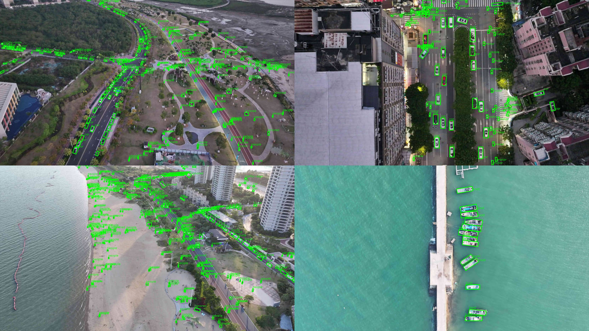
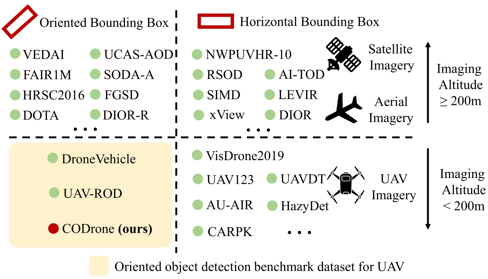
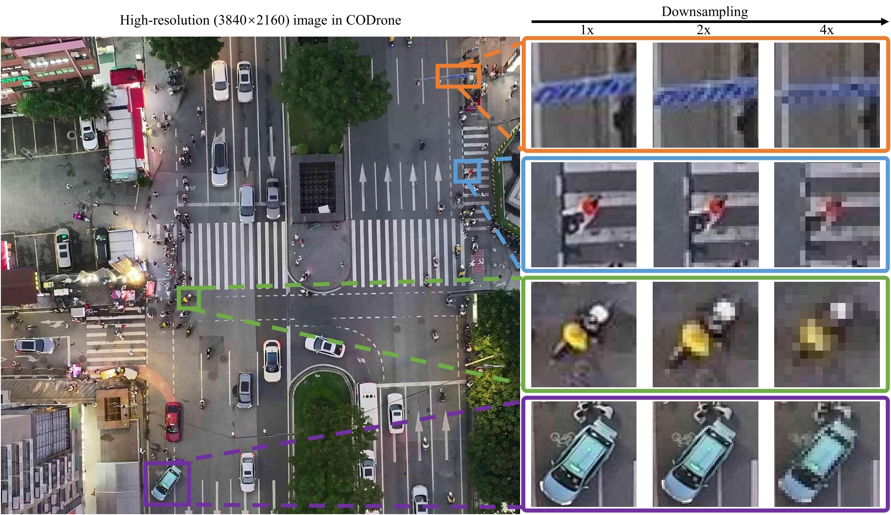
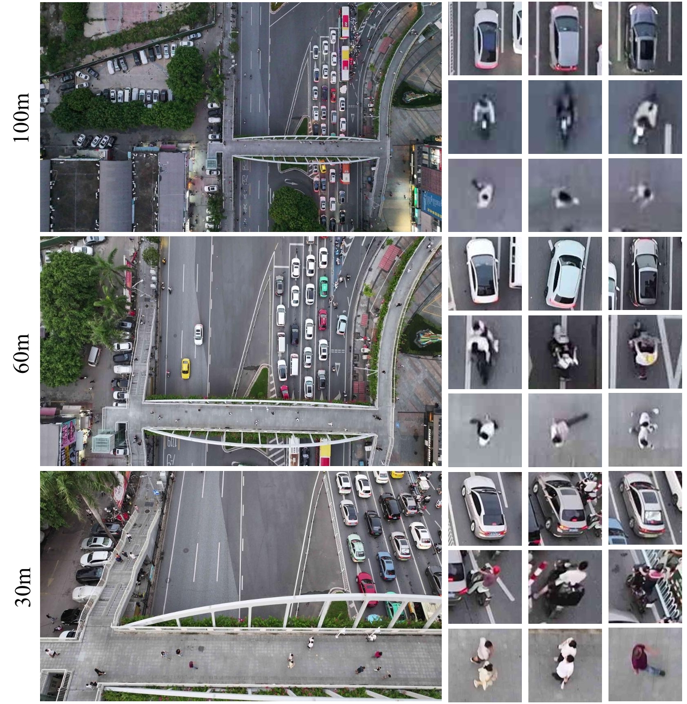
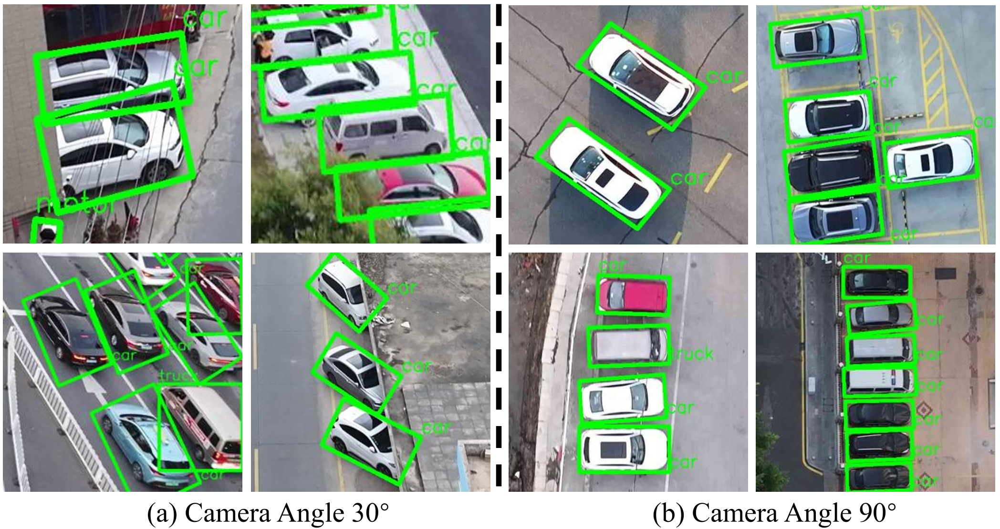
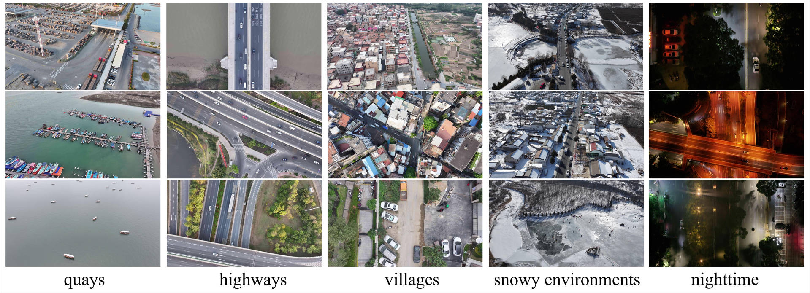

<p align="center">
<!--   <h1 align="center"></h1> -->
  <h1 align="center"> <b>CODrone</b>: A Comprehensive Oriented Object Detection benchmark for UAV</h1>
  <p align="center">
        <a href="https://arxiv.org/abs/2504.20032"></a>
        <a href='https://drive.google.com/file/d/1FQ6mUaOr_kATDaH7N2bObD5SRRkV7qJy/view?usp=sharing'></a>
  </p>


<!--  -->
**😊 TL;DR**

CODrone is a comprehensive oriented object detection dataset for UAVs that accurately reflects real-world conditions. 

<div align="center">
  
<table>
  <tr>
    <td align="center" valign="middle">
      
    </td>
    <td align="center" valign="middle">
      
    </td>
  </tr>
</table>

</div>

**⭐ Key contributions of CODrone**:

- We proposed a **large-scale**, **high-resolution** **UAV**-**oriented object detection** dataset, CODrone, which consists of over ten thousand UAV-captured images with precise **oriented bounding box** annotations and **diverse object categories**.
- The proposed CODrone dataset considers multiple influential factors, including **image acquisition altitude**, **camera perspective**, **lighting conditions**, and **geographic location**. 
- Based on the proposed dataset, we establish a UAV-oriented object detection benchmark and conduct training and evaluation using X representative state-of-the-art methods. 

**🚀 Try it out!!!**:

- 📥 [Download from Google Drive](https://drive.google.com/file/d/1FQ6mUaOr_kATDaH7N2bObD5SRRkV7qJy/view?usp=sharing)

- 📥 [Download from Quark Drive](https://pan.quark.cn/s/6028b38fe7c8)
  
```shell
CODrone/
├── test/
│   ├── annfile/     # DOTA format annotation
│   ├── images/
│   └── labels/      # VOC format annotation
├── train/
│   ├── annfile/
│   ├── images/
│   └── labels/
└── val/
    ├── annfile/
    ├── images/
    └── labels/
```

## Characteristics
<div align="center">
  
|     Dataset    | Resolution | Categories | Altitude Gap | Camera Angles | Images | Objects | OBB |
|:--------------:|:----------:|:----------:|:------------:|:-------------:|:------:|:-------:|:---:|
|  VisDrone2019  |  2000×1500 |     10     |       *      |       *       |  10.2k |   54.2k |     |
|      UAVDT     |   1080×540 |      3     |      60m     |       *       |  80.0k |  841.5k |     |
|     AU-AIR     |  1920×1080 |      8     |      25m     |       45      |   3.2k |  132.0k |     |
|      CARPK     |   1280×720 |      1     |       *      |       *       |   1.4k |   89.7k |     |
|     HazyDet    |   1333×800 |      3     |       *      |       *       |  11.6k |  383.0k |  　 |
|  DroneVehicle  |    840×712 |      5     |      40m     |       30      |  56.8k |  953.0k |  ✅  |
|     UAV-ROD    |  1920×1080 |      1     |      50m     |       *       |   1.5k |   30.0k |  ✅  |
| **CODrone (ours)** |  **3840×2160** |     **12**     |      **70m**     |       **60**      |  10.0k |  596.7k |  ✅  |

</div>
We present a comparison between CODrone and other commonly used UAV-based object detection datasets.
CODrone significantly expands several key dimensions, including image resolution, object category diversity, and variation in flight altitude and camera angle.
For resolution, CODrone employs a 3840 × 2160 high-resolution onboard camera, aligning with the capabilities of modern UAV hardware.
In terms of object classes, unlike most existing UAV OOD datasets that focus primarily on vehicles, CODrone includes a more diverse range of categories, thereby increasing the difficulty and realism of the detection task.
Furthermore, we explicitly annotate both altitude and camera angle for each image, enabling research into UAV pose-aware perception and related tasks. 


### High resolution brings more high-quality information
<div align="center">



</div>

CODrone employs a **3840 × 2160** high-resolution onboard camera, aligning with the capabilities of modern UAV hardware.

### Multi-altitude and multi-angle captures for broad flight scenario adaptation

<div align="center">
  
<table>
  <tr>
    <td align="center" valign="middle">
      
    </td>
    <td align="center" valign="middle">
      
    </td>
  </tr>
</table>

</div>

The UAV was configured to capture imagery from two camera angles (**30°** and **90°**) and at three flight altitudes (**30 m**, **60 m**, and **100 m**), resulting in a total of **6** unique viewpoint combinations.


### More diverse scenes, broader application potential
<div align="center">



</div>

CODrone covers a wide range of environments, from urban areas and rural towns to ports and industrial zones, encompassing most scene types encountered in real-world UAV-based urban applications.

## How to visualize CODrone annotations

1) Install
```bash
pip install opencv-python numpy
```

2) Edit paths in `Vis_CODrone_GT.py` (inside `main()`):
```python
img_dir    = "CODrone/train/images"
label_dir  = "CODrone/train/annfile"   
output_dir = "CODrone/train/viz"
```

3) Run
```bash
python Vis_CODrone_GT.py
```

## How to split CODrone images

1) Install
```bash
pip install opencv-python numpy pillow shapely
```

2) Run (DOTA-style sliding window & IOF assignment) — **direct args**
```bash
python CODrone_Split.py   --img-dirs CODrone/train/images   --ann-dirs CODrone/train/annfile   --sizes 1024   --gaps 512   --rates 1.0   --img-rate-thr 0.6   --iof-thr 0.7   --save-dir CODrone/train/splits   --save-ext .png   --nproc 8
```

or **via JSON config** (recommended; CLI flags override JSON):
```bash
# examples (pick one)
python CODrone_Split.py --base-json split_configs/ss_train.json
python CODrone_Split.py --base-json split_configs/ss_val.json
python CODrone_Split.py --base-json split_configs/ss_test.json
```

3) Output
- Patches: `CODrone/train/splits/images/`
- DOTA style txts for patches: `CODrone/train/splits/annfiles/`

**Note:** Tiling (sizes/gaps/rates), IOF-based object assignment, truncation handling, and label writing strictly follow **DOTA devkit** conventions.

## Citation

```
@misc{ye2025clearflexibleprecisecomprehensive,
      title={More Clear, More Flexible, More Precise: A Comprehensive Oriented Object Detection benchmark for UAV}, 
      author={Kai Ye and Haidi Tang and Bowen Liu and Pingyang Dai and Liujuan Cao and Rongrong Ji},
      year={2025},
      eprint={2504.20032},
      archivePrefix={arXiv},
      primaryClass={cs.CV},
      url={https://arxiv.org/abs/2504.20032}, 
}
```


## License

Licensed under the CC BY-NC-SA 4.0 (Attribution-NonCommercial-ShareAlike 4.0 International)


The code is released for academic research use only. 

If you have any questions, please contact me via [yekai@stu.xmu.edu.cn]. 
